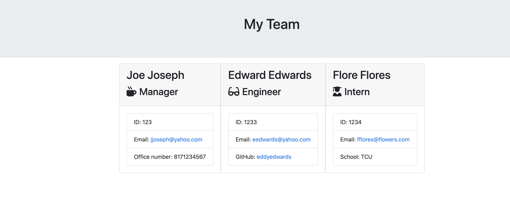

# Unit 10 OOP Homework: Template Engine - Employee Summary

The purpose of this assignment is to build a Node CLI that takes in information about employees and generates an HTML webpage that displays summaries for each person. Testing is a key piece in making code maintainable, all units will be tested and pass the tests.


## Who is the end user?

```
As a manager
I want to generate a webpage that displays my team's basic info
so that I have quick access to emails and GitHub profiles
```




### Minimum Requirements

* Functional application.

* GitHub repository with a unique name and a README describing the project.

* User can use the CLI to generate an HTML page that displays information about their team.

* All tests must pass.


### Submission on BCS

Required to submit the following:

* The URL of the GitHub repository:  https://github.com/simplyvpthar/Team-Generator.git

* A video demonstrating the entirety of the app's functionality:  https://drive.google.com/file/d/1x-jgRxFjIoYAnsmLO7tE8GyipgmnqxBy/view 


